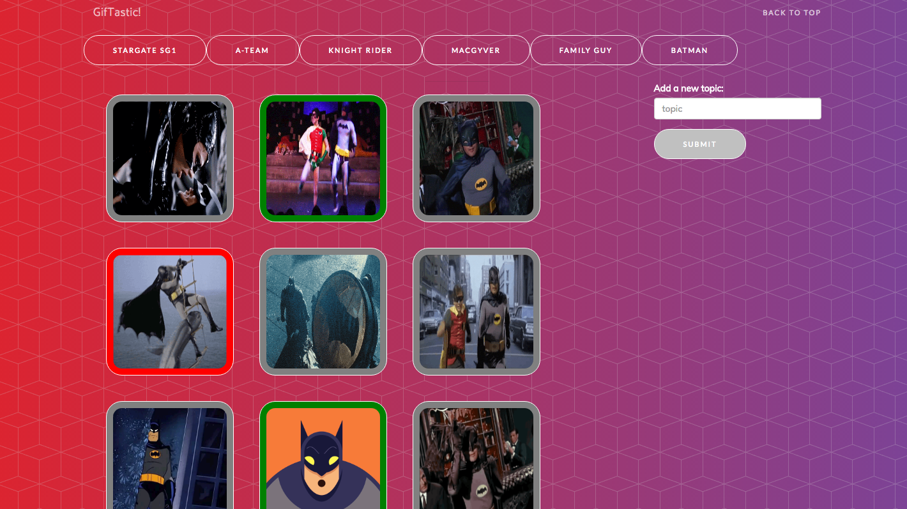

# GifTastic

# :movie_camera: :camera: GifTastic Homework Assignment :camera: :movie_camera:
A web app that pulls GIFs from GIHPY!

## Overview

This web app allows you to retrieve gifs from GIPHY and start/stop animations.

## Homepage

## Functionality
The app uses jQuery and the GIPHY web api to retieve the top 10 gifs related to a topic.User can then click on the gif to start and stop animation

## Cloning down the repo
All files needed to run this app locally are in the project. Just download/clone and run index.html

## Tech used

    "new age bootstrap template": "https://startbootstrap.com/template-overviews/new-age/",
    "giphy api" : "v1",
    "bootstrap": "1.17.1",
    "jquery": "v1.12.4",
    "javascript": "ECMAScript 5",
    "css": "3",
    "html": "5"

## Author
* **Chirag K Shah** - [cshah9](https://github.com/cshah9)